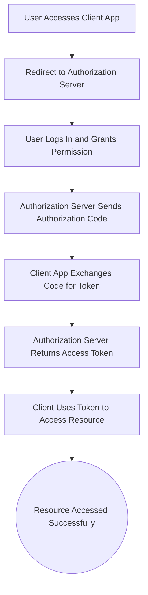

# <span style="color: black;"> Oauth Authentications </span>


EasyParcel's API uses the OAuth 2.0 authorization framework to ensure secure access to its services. OAuth 2.0 allows applications to authenticate and access the API on behalf of a user without directly exposing user credentials. 

## OAuth 2.0
- **Grant Types Supported**: Authorization Code, Client Credentials

OAuth (Open Authorization) is an open standard protocol that allows secure authorization in a simple and standardized way from web, mobile, and desktop applications. EasyParcel uses OAuth to enable applications to securely access resources on behalf of the user without exposing the user's credentials.

**OAuth involves three main components:**

1. **Client**: The application requesting access to the user's resources.

2. **Resource Server**: The server hosting the protected resources.

3. **Authorization Server**: The server responsible for authenticating the user and issuing access tokens.


### Security Considerations
Ensure to use HTTPS to protect communication between clients and servers to prevent eavesdropping and man-in-the-middle attacks.

## OAuth 2.0 Authorization Flow




### Authorization Endpoint
The Authorization Endpoint is used by the client to obtain authorization from the resource owner via user-agent redirection.
### Endpoint URL: 
https://api.easyparcel.com/oauth/login


### Token Endpoint
The Token Endpoint is used by the client to obtain an access token by presenting its authorization grant.
### Endpoint URL: 
https://api.easyparcel.com/oauth/token


## Get OAuth Access token

1.) Pass the below params to the urls
```
https://api.easyparcel.com/oauth/login
```

Request:

| **Requested Parameters** | **Type** | **Required** | **Details**                                                                                                                   | Remarks |
| ------------------------ | -------- | ------------ | ----------------------------------------------------------------------------------------------------------------------------- | ------- |
| client_id                | string   | Yes          | client_id of your application                                                                                                 | -       |
| redirect_uri             | string   | Yes          | The URI to which the client was redirected from the authorization server. The url of your app to redirect to                  | -       |
| state                    | string   | Optional     | Generate and pass a unique string that helps ensure the response comes from the same client request, preventing CSRF attacks. | -       |

2.) Will be prompt to login (these below steps are to authorize linking the application to your easyparcel account)
1. Login to your easyparcel account
	<p align="center">
	
	</p>

2. Select an account desire to link (You can select either Demo or live account)
   
 
   If you have not yet setup demo account, you follow : [To setup demo account](#sandbox-account)
   
	<p align="center">
   	
	</p>


4.  Allow access to Authorize link the account to with the application
   
	<p align="center">
	
	</p>


2.) Respond param in redirect url
Sample redirect url respond: 
```
https://your-callback-url/callback?code=(code that requires to regenerate access token)
```
- code(pass in get access token url)
- state (if got pass in auth url request)

| Responded Parameters | Type   | Details                                                                                                     | Remarks |
| -------------------- | ------ | ----------------------------------------------------------------------------------------------------------- | ------- |
| code                 | string | The authorization code to pass to Oauth to get the access token.                                          | -       |
| state                | string | A unique string that helps ensure the response comes from the same client request, preventing CSRF attacks. | -       |


3.) Pass the below params to get access token url or refresh access token url
```
https://api.easyparcel.com/oauth/token
```

**Request:**

- grant_type = “authorization_code”
- redirect_uri
- code
- refresh_token (if want refresh access token)
- state (optional)

Header
authorization - Basic [encoded base:64 format (app_client_id:app_secret)]

-> get the string for app_client_id and app_secret from developer hub <br> ->
Encode both client_id and app_secret into 64 format <br> ->
Use encoded value and pass back into Basic<br> 

| Requested Parameters | Type   | Required                                   | Details                                                                                                                                 | Remarks                      |
| -------------------- | ------ | ------------------------------------------ | --------------------------------------------------------------------------------------------------------------------------------------- | ---------------------------- |
| grant_type           | string | Yes                                        | The authorization_code to generate the access token.                                                                                    | default = authorization_code |
| redirect_uri         | string | Yes                                        | The URI to which the client was redirected from the authorization server. The URL of your app to redirect to.                           | -                            |
| code                 | string | Yes                                        | The authorization code received from the OAuth flow that needs to be exchanged for an access token.                                     | -                            |
| refresh_token        | string | Optional (Required for refresh)            | The token that requests to generate a new access token once the current token expires.                                                  | -                            |
| state                | string | Optional                                   | Request to check the state. A unique string that helps ensure the response comes from the same client request, preventing CSRF attacks. | -                            |


4.) then will respond back with the access_token

```json
{
	"token_type": "Bearer",
	"expires_in": 36000,
	"expires_at": "2024-12-12T13:03:23.013Z",
	"access_token": "your access token",
	"refresh_token": "Your refresh token",
	"refresh_token_expires_in": 31557600,
	"refresh_token_expires_at": "2025-12-12T09:03:23.013Z",
	
	"app": {
	"client_id": "your client-id",
	"callbackUrls": [],
	"redirectUris": [ "Your redirect uri"]
	}
}
```


| Responded Parameters     | Type      | Details                                                                            | Remarks              |
| ------------------------ | --------- | ---------------------------------------------------------------------------------- | -------------------- |
| token_type               | string    | Token type                                                                         | -                    |
| expires_in               | int       | The token life span in seconds                                                     | -                    |
| expires_at               | date time | The Access token expiry date                                                       | -                    |
| access Token             | string    | The access token, required to access the API                                       | -                    |
| refresh_token            | string    | The new Refresh token for the next refresh (Depends if requested on Oauth/token) | -                    |
| refresh_token_expires_in | int       | The refresh token life span in seconds                                             | -                    |
| refresh_token_expires_at | date time | The refresh token expiry date                                                      | -                    |
| App                      | array     | informations regarding your applications                                           | Refer to [App](#App) |


### App

| Responded Parameters | Type   | Details                                                                               | Remarks |
| -------------------- | ------ | ------------------------------------------------------------------------------------- | ------- |
| client_id            | string | Client ID of the application                                                          | -       |
| callbackUris         | string | Destination that sends the user back after they have authenticated and granted access | -       |
| redirectUris         | string | Redirect destination for the user after the authorization process                     | -       |

5.) Use the access token to call the [API Endppoints](#version-2025-06)

