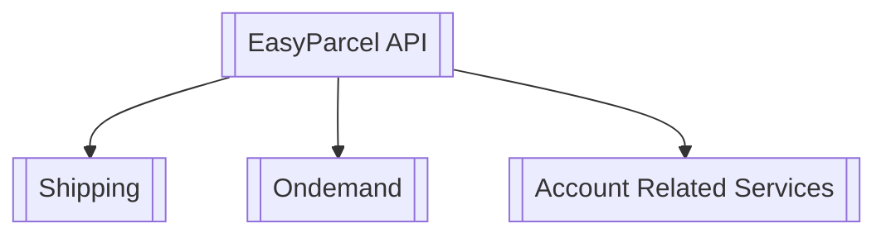

#  API Functions & Features 

The EasyParcel API offers various functionalities grouped under different categories. Below is an overview of the key features:

#### **Standard Shipping**:
- Scheduled Delivery

- Cost-effective

- Tracking Available

- Suitable for high volume shipment

#### **OnDemand Shipping**:

- Speed: providing same-day delivery.

- Real-Time Tracking: You can track your parcel in real-time once the booking is made.

- Flexibility: You can choose your preferred vehicle and schedule the pick-up time.

- Cost-Efficiency: You only pay for the services you need.

- Priority Handling: Parcels are prioritized, ensuring faster delivery compared to standard methods.

#### **Wallet**:
- All submission will be deducting from credit waller

#### **Get Courier List**:
- Getting all the courier listing available for a country

#### **Get Coupon List**:
- Getting coupon available for the order for both standard shipping and ondemand

---

## EasyParcel API Structure Overview

This document provides a visual representation of the different flows and processes available through the EasyParcel API.

## API Structure Diagram

---

### Standard
  
[Get Shipment Quotation](#shipment-quotations)

[Coupon Listing](#coupon-feature)

[Submit Shipment Order](#submit-orders)

[Get Shipment Listing](#shipment-listing)

[Get Shipment Details](#shipment-details)

[Cancel Order](#cancel-shipments)

### OnDemand

[Get OnDemand Quotation](#ondmeand-quotation)

[Coupon Listing](#ondemand-coupon)

[Submit OnDemand Order](#ondemand-order-submission)

### Wallet

[Get Wallet](#wallet-balance)

### Courier List
[Courier Listing](#couriers-list)

