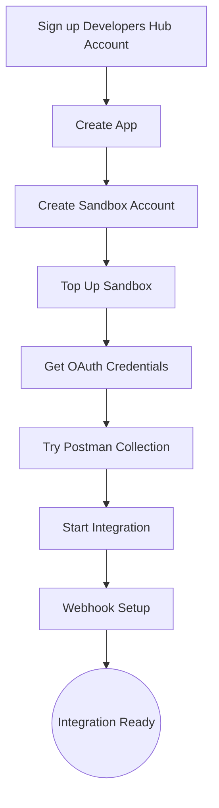

#  Introduction 
#  EasyParcel API Documentation 

Welcome to the **EasyParcel API Documentation**! This guide will help you integrate with EasyParcel and get access to shipping functionalities via a RESTful API interface. 

## **Overview**

The **EasyParcel API** enables you to manage shipping, obtain quotations, track shipments, and much more. It's designed using a RESTful architecture, offering a seamless integration with various e-commerce platforms and third-party applications.

### **Key Benefits**:
- **Rate Calculation**: Get live rates from various couriers.
- **Order Management**: Create, update, and manage shipments.
- **Tracking**: Real-time tracking updates for shipments.
- **Effortless APP Integrate**: Easy integration with your online store or application.

## **Setup Flow**

Below is a visual guide to set up flow:

## **Getting Started**

To begin using the EasyParcel API, follow the steps below to set up your environment:

- [Register Developer account](1.Developer%20Hub)
- [Create Sandbox account](2.Create%20Sandbox)
- [Oauth](3.OAuth%20Authentication)
- [Postman_collections](4.Postman%20Collection)
- [API Endpoint](5.API%20endpoint)
- [Webhook](6.Webhook)

Once set up, you can use the provided **Sandbox** environment to test the API without impacting live data.

## **OAuth Authentication**

EasyParcel uses **OAuth 2.0** for secure authentication, enabling controlled access to the system.

1. **OAuth 2.0 Overview**:
    - OAuth 2.0 is a standard authorization framework allowing third-party applications to access your EasyParcel resources without exposing sensitive credentials.
  
2. **Steps to Obtain OAuth Token**:
    - [Learn about OAuth Authentication](3.OAuth%20Authentication)
    - [Getting OAuth Access Token](3.OAuth%20Authentication/2.OAuth.md)

## **API Functions & Features**

The EasyParcel API offers a wide array of functionalities divided into categories. Below are the key features available:

### **Standard Features**:
- **Get Shipment Quotation**  
  Get a detailed quote for your shipment, including rates, delivery times, and courier options.  
  [Read more](/5.API%20endpoint/%201.Shipping/1.Get%20Shipment%20Quotation.md)

- **Get Coupon List**  
  Fetch all available courier according to the country.
  [Read more](/5.API%20endpoint/%201.Shipping/2.Get%20Coupon%20List.md)

- **Submit Shipment Orders**  
  Create and submit shipment orders for processing.  
  [Read more](/5.API%20endpoint/%201.Shipping/3.Submit%20Orders.md)

### **OnDemand Features**:
- **Get OnDemand Quotation**  
  Get an on-demand quotation based on specific criteria.  
  [Read more](/5.API%20endpoint/%202.Ondemand/1.Get%20Ondemand%20Quotation.md)

- **Submit OnDemand Order**  
  Create an on-demand shipment order.  
  [Read more](/5.API%20endpoint/%202.Ondemand/2.Submit%20Ondemand%20Order.md)

### **Wallet Features**:
- **Get Wallet Balance**  
  Check your current wallet balance for API transactions.  
  [Read more](/5.API%20endpoint/3.Get%20Credit%20Wallet.md)

#### **Contact Us**

If you have any questions or need further support with the EasyParcel API, our team is available for assistance. You can reach out to us via the following channels:
- **WhatsApp Support**: For quick support, chat with our team directly on WhatsApp. Click [here](https://wa.me/6042023160) to start a conversation.

We’re here to help you integrate and make the most out of EasyParcel’s services!